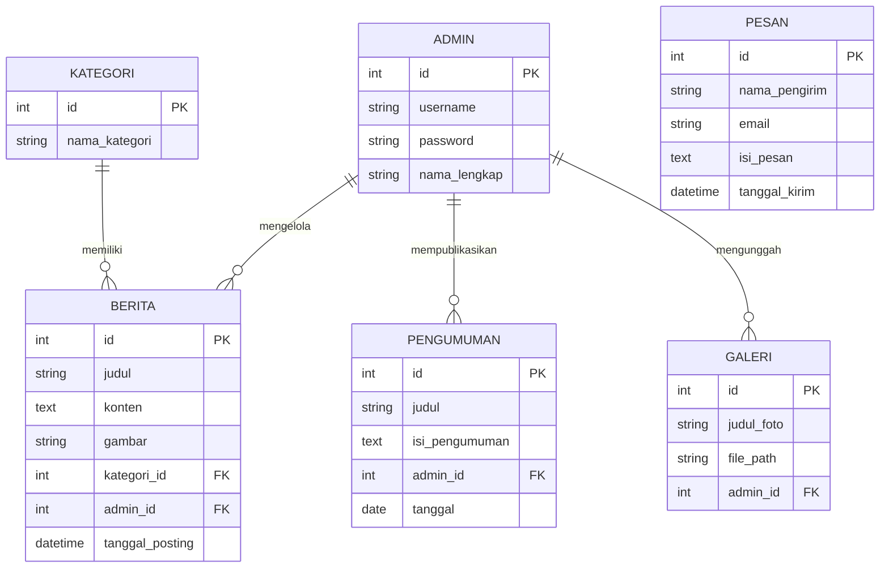

# PERANCANGAN SISTEM - CMS COMPANY PROFILE / WEBSITE SEKOLAH

Dokumen ini berisi perencanaan struktur aplikasi, hirarki menu, dan Entity Relationship Diagram (ER-D) untuk pengembangan CMS Website Profil Sekolah.

---

## 1. Hirarki Menu (Sidebar / Navbar)

Berikut adalah rancangan struktur menu navigasi, terbagi menjadi Halaman Publik (Frontend) dan Panel Admin (Backend CMS):

- **Frontend (Website Utama / Publik)**
  - **Beranda (Home):** Banner/Slider, Sambutan Kepala Sekolah, Berita Terbaru, Profil Singkat
  - **Profil:** Sejarah, Visi & Misi, Struktur Organisasi, Guru & Staf
  - **Akademik:** Program Studi / Jurusan, Kalender Akademik, Kurikulum
  - **Kesiswaan / Galeri:** Ekstrakurikuler, Prestasi, Galeri Foto & Video Kegiatan
  - **Kontak:** Formulir Pesan, Peta Lokasi, Media Sosial

- **Backend (Admin CMS / Dashboard)**
  - **Dashboard:** Statistik Pengunjung, Ringkasan Berita & Pesan Masuk
  - **Manajemen Konten:**
    - Berita / Artikel (Tambah, Edit, Hapus, Kategori)
    - Pengumuman Sekolah
    - Agenda Kegiatan
  - **Manajemen Galeri:** Upload Foto & Video
  - **Manajemen Pesan:** Kotak Masuk (Pesan dari Pengunjung)
  - **Pengaturan Website:** Identitas Sekolah, Ganti Logo, Ganti Password Admin

---

## 2. Entity Relationship Diagram (ER-D)

Berikut adalah rancangan ER-D sederhana menggunakan sintaks Mermaid.js untuk entitas utama (Admin, Berita, Kategori, Galeri, dan Pesan):

##DESIGN FIGMA
https://www.figma.com/design/bWU3cN8hWFlQ4QdB0mTPvL/Untitled--Copy-?node-id=2003-8&t=cSj6l4XYwkjomRR1-1
